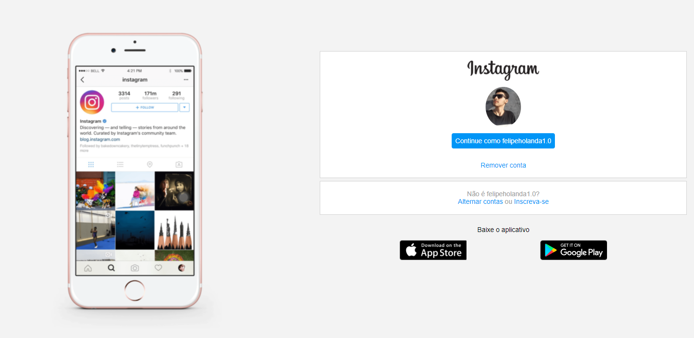

   

ÍNDICE...

<a href="#sobre-o-projeto">Sobre</a> • 
<a href="#Imagem">Imagem</a> • 
<a href="#Tecnologias--">Tecnologias</a> • 
<a href="#Ferramentas">Ferramentas</a>

 

<h1 align="center">Sobre o Projeto</h1>

<h4 align="center">Site responsavel pela página de login do instragam para usuarios antigos e novos</h4>

------------------------------------------------------------------------------------------------------------------------------

<h1 align="center">Imagem</h1>

<h1 align="center">
   
</h1>

  <h2 align="center">Tecnologias 🚀 </h2>

  
As seguintes ferramentas foram usadas na construção do projeto:

  - [x] **HTML**
  - [x] **CSS**

  ### Ferramentas

  - [**VS CODE**](https://code.visualstudio.com/)

 

  <h1>Siga-me</h1>
  
Made with 💜 by FELIPE HOLANDA 👋🻠[See my Linkedin](https://www.linkedin.com/in/felipe-holanda-de-freitas-3a91281a2/)

  
 

   

